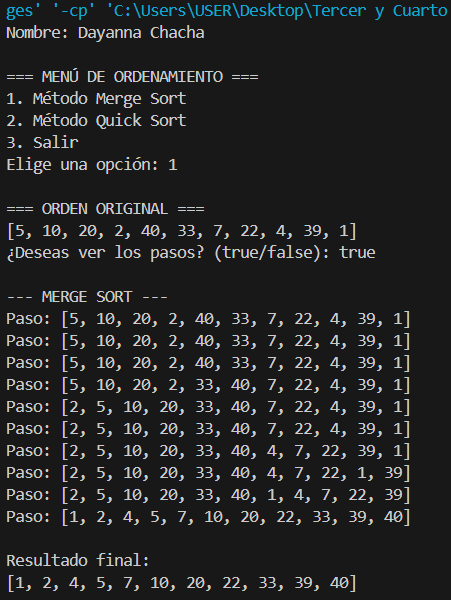
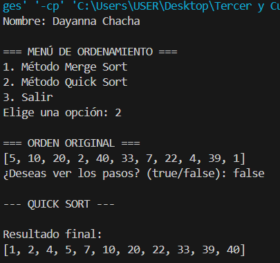

# 🧩 ESTRUCTURA DE DATOS

**Nombre del Estudiante:** Janelly Dayanna Chacha Vélez  
**Fecha:** Práctica 2 – 4 de Noviembre  

---

## 🧠 Métodos de Ordenamiento Avanzado (MergeSort y QuickSort)

### 📝 Descripción General
En esta práctica se implementaron dos algoritmos de ordenamiento eficientes: **MergeSort** y **QuickSort**.  
El programa está desarrollado en Java y permite elegir entre ambos métodos mediante un **menú simple**, además de activar o desactivar la opción de mostrar los **pasos intermedios** durante la ejecución.

El usuario puede:
1. Seleccionar el algoritmo de ordenamiento.  
2. Elegir si desea visualizar los pasos intermedios (`true` o `false`).  
3. Ver el resultado final del arreglo ordenado.  
4. Repetir el proceso o salir del programa.  
 ---

##Salidas esperadas
1. Merge Sort

2. Quick Sort
